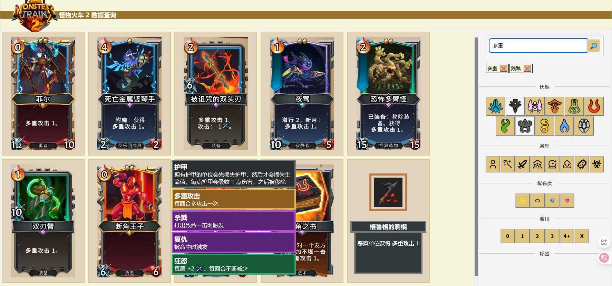
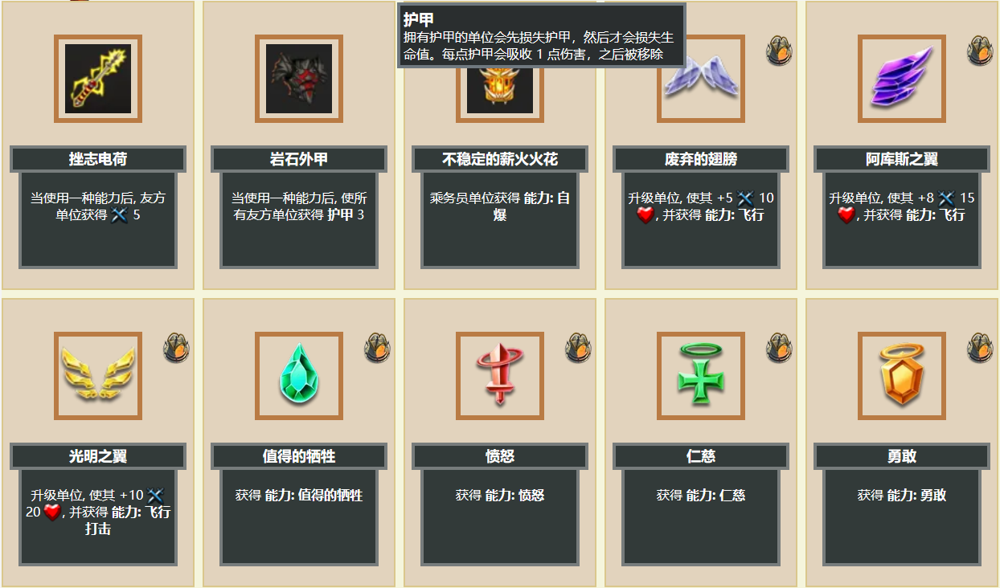
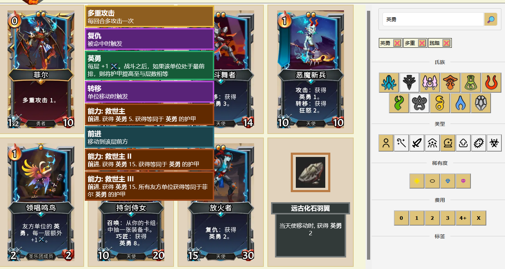
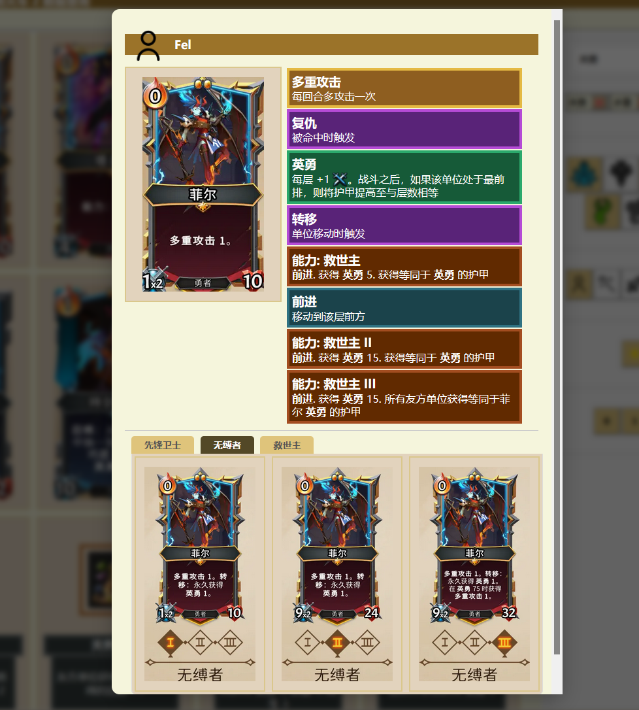
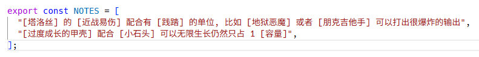
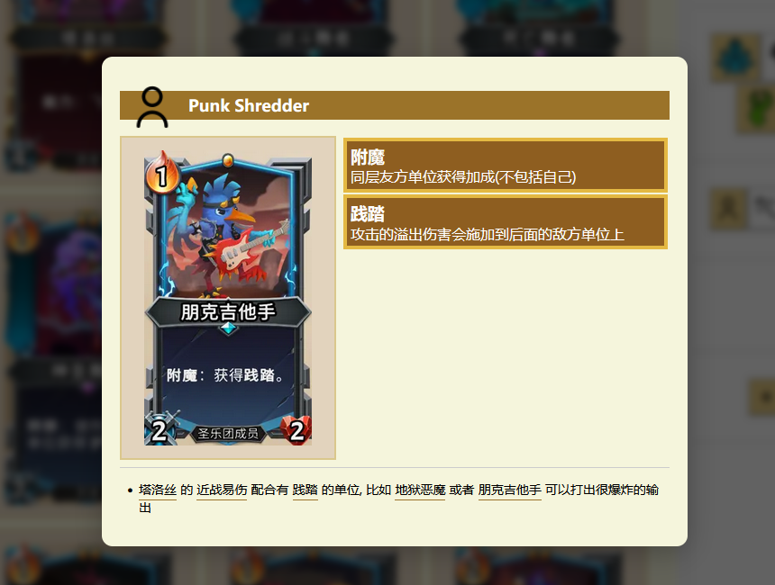

# KRougeData

用于 `RougeLike` 游戏的信息搜索工具. 

## 怪物火车 2

### 搜索功能增强

可以选中多个 `氏族`/`种类`/`稀有度`/`费用`

鼠标双击 `氏族`/`种类`/`稀有度`/`费用` 可以快捷实现单选功能

搜索过的词汇会在输入框下方添加快捷标签, 点击即可使用该词汇搜索

### `神器`和`升级石`的数据

`神器`和`升级石` 可以像其他卡牌一样被搜索到

### 从英雄升级的词条搜索到英雄

比如 `菲尔` 是和 `英勇` 词条紧密相关的, 但游戏中搜索 `英勇` 是无法搜索到 `菲尔` 的

此工具从英雄的升级中提取了所有词条到英雄上, 所以可以通过 `英勇` 搜索到 `菲尔`, 或是通过 `贪婪` 搜索到 `吉尔达女士`

### 详情页面

最上方显示英文名字, 鼠标单击即可复制至剪切板, 方便 mod 用户

如果是英雄, 会显示所有升级路径

最下方显示小技巧, 可以自定义

未来还会添加其他内容

### 自定义笔记

可以对卡牌添加自定义笔记

打开 `data\monster-train-2\notes.js` 文件

在这里添加内容即可, 卡牌/神器/升级石/词条的名字用中括号 `[]` 括起来, 显示的时候就可以自动关联数据并生成超链接

每句笔记涉及到的所有卡牌都会在其详情页面显示这一条内容,

比如 `[塔洛丝] 的 [近战易伤] 配合有 [践踏] 的单位, 比如 [地狱恶魔] 或者 [朋克吉他手] 可以打出很爆炸的输出`

在 `塔洛丝`,`地狱恶魔`,`朋克吉他手` 的页面都会自动显示这一条

点击其中的超链接可以切换到对应卡牌的详情页面

## 安装和运行

步骤如下:

* 去 release 页面, 下载并解压最新的 `build v0.xxx.zip` 文件
* 双击 `server.exe`. 如果正常会弹出浏览器页面并导航至 `https://localhost:7770`

`server.exe` 是一个极简的 web 服务器, 可以用你喜欢的 web 服务器替代

源码在项目的 `server/server.go`. Mac 用户需要可自行编译

## 开发和编译

`/img` 目录下存放的是原始的 `png` 文件, 尺寸很大, 通过 `/tool/compress-img-*.bat` 文件转换为 `webp` 文件放在 `/image` 目录, 大概尺寸变为原来的 1/10

打包通过 `/tool/build.ps1` 进行, 包括 `server/server.go` 的编译, 以及把必要的文件压缩为 `/build/build.zip` 文件

## TODO://

* 来源于事件的部分升级石的中文名是从英文 wiki 翻译来的, 未和游戏中的翻译核对
* 数据整理的匆忙, 未全面检查
